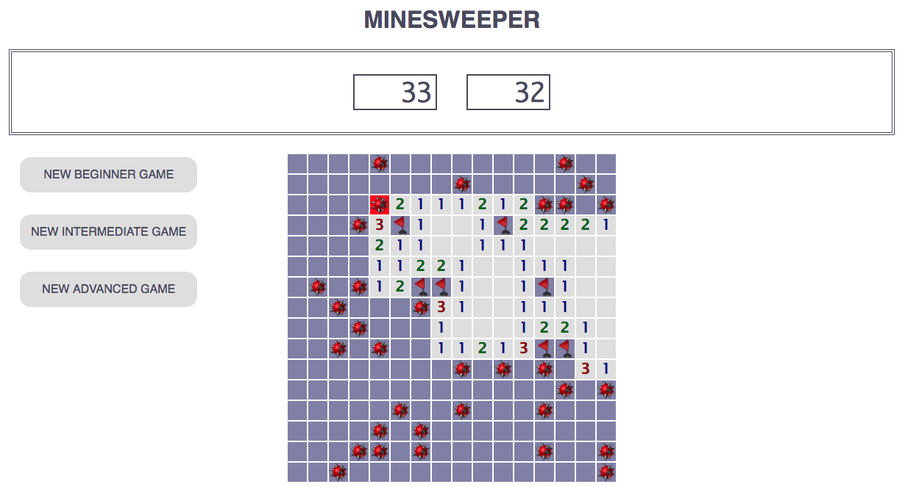

# Minesweeper Challenge
---
## Summary
Simple implementation of the game Minesweeper. Working game was deployed to Heroku at https://simple-minesweeper.herokuapp.com/.

## Stack/Architecture
Frontend: Plain JS/HTML/CSS with jQuery.

Backend: No backend.

## Project Layout
All frontend code can be found in the [public](/public) folder. Open [game.js](/public/game.js) for game logic.

